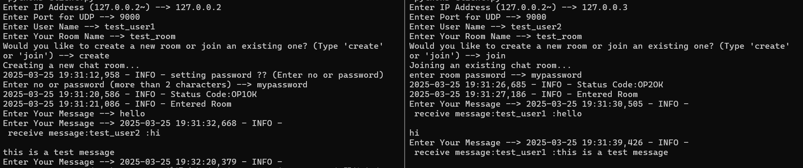

# Online Chat Messenger

## 概要
チャットメッセンジャー

## 実行方法

### サーバー側

TCPサーバーの起動
```
python3 tcp_server.py
```
UDPサーバーの起動
```
python3 udp_server.py
```

### クライアント側
```
python3 client.py
```
### ルーム作成
はじめに，ホストユーザはIPアドレスを選択する．（現在ローカルの1台のPCで簡易的に作成した状態で，ローカルループバックアドレスを用いているためこの操作が必要）
<br>
続いて利用するポート番号を選択する．
<br>
次に作成するルーム名を入力して，createを入力．その後，パスワードを設定するか聞かれるため，設定するのであれば，利用するパスワードを，利用しないのであればnoと打ち込む．
<br>
そして，TCPサーバからステータスメッセージとチャットルームのためのトークンを受け取る．（表示されるのはステータスメッセージのみ）
<br>
受信後，メッセージの受信・送信が可能となる．
<br>

### パスワード設定時のルーム作成方法例
```
Enter IP Address (127.0.0.2~) --> 127.0.0.2
Enter Port for UDP --> 9000
Enter User Name --> test_user1
Enter Your Room Name --> test_room
Would you like to create a new room or join an existing one? (Type 'create' or 'join') --> create
Creating a new chat room...
2025-03-25 19:31:12,958 - INFO - setting password ?? (Enter no or password)
Enter no or password (more than 2 characters) --> mypassword
2025-03-25 19:31:20,586 - INFO - Status Code:OP1OK
2025-03-25 19:31:21,086 - INFO - Entered Room
```
パスワードを非設定にする場合は，mypasswordの部分をnoに変更する．


### ルームへの参加例（ホスト以外のユーザ）
```
Enter IP Address (127.0.0.2~) --> 127.0.0.3
Enter Port for UDP --> 9000
Enter User Name --> test_user2
Enter Your Room Name --> test_room
Would you like to create a new room or join an existing one? (Type 'create' or 'join') --> join
Joining an existing chat room...
enter room password --> mypassword
2025-03-25 19:31:26,685 - INFO - Status Code:OP2OK
2025-03-25 19:31:27,186 - INFO - Entered Room

```

### チャットの様子



### ホスト退去・サーバからユーザ削除削除
一定時間ユーザがメッセージを送信しない場合は，サーバのルーム登録者から削除され，メッセージが転送されなくなる．サーバから削除された際には，その旨を通知するメッセージを受信し，プログラムが終了するため，再度ルームへ参加するには，プログラムの再実行が必要となる．

また，ホスト退去時には，自身の最終メッセージ送信時刻からの経過時間に関係なくルーム内のユーザが全て削除される．


